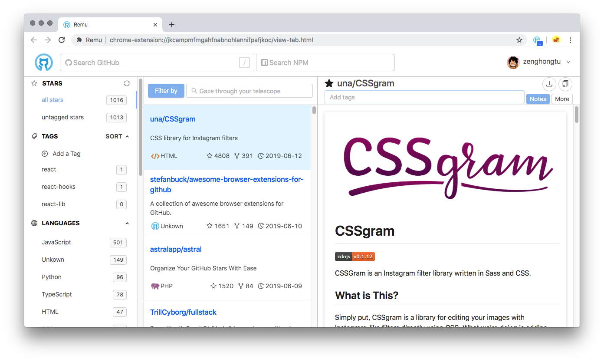
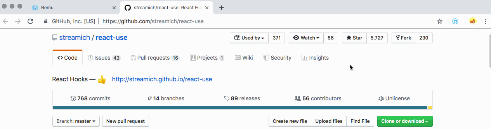
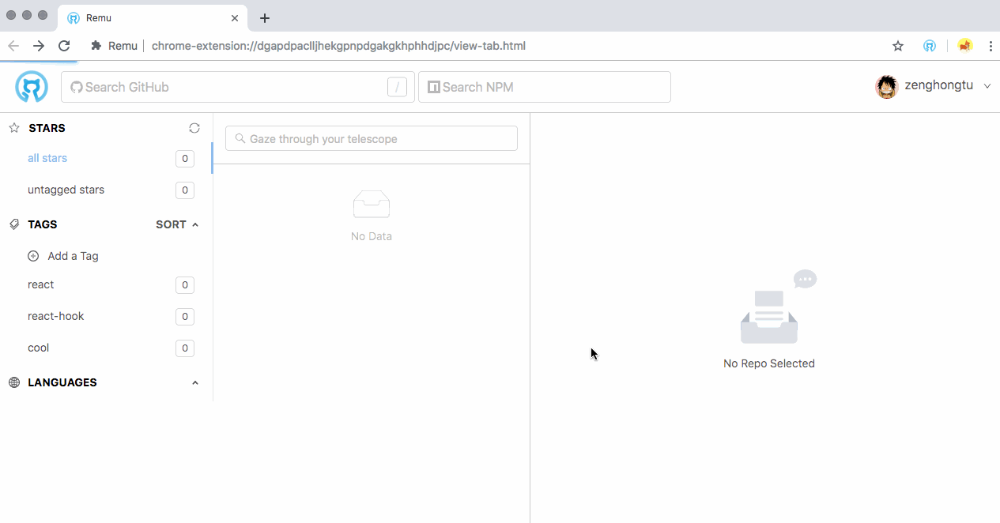
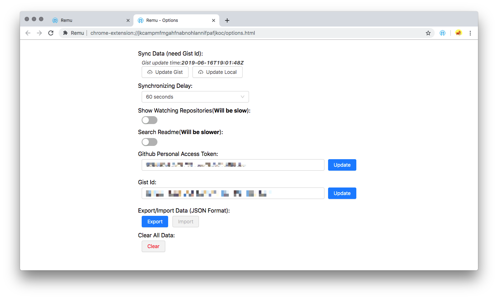
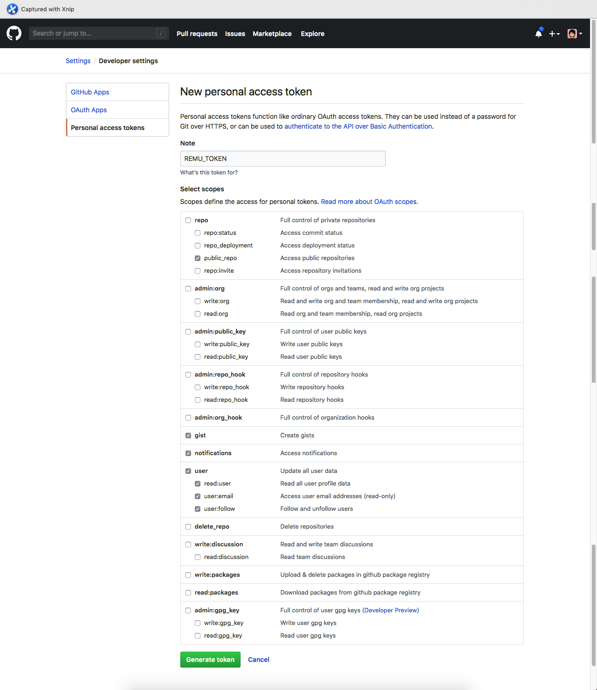

<p align="center">
<a href="https://chrome.google.com/webstore/detail/remu/bajifjohhghngljcfhkbpcggafpiajdo"></a>
<div align="center">
<span style="font-size:16px;">Remu</span> - <span style="font-size:14px;font-weight:300;">高效管理你的 GitHub Stars 从未如此轻松。</span>
</div>
</p>

---

<div align="center">
 <div><a style="font-size:12px" href="./README.en.md">[English README]</a></div>
  <div>
    <a href="https://github.com/zenghongtu/Remu/releases"></a>
<a target="_blank" rel="noopener noreferrer" href="https://camo.githubusercontent.com/3bb863d4a8a6ddd0c2c4b4c67dab6bb58dee9b07/68747470733a2f2f696d672e736869656c64732e696f2f6769746875622f6c6963656e73652f7a656e67686f6e6774752f4d6f622e7376673f7374796c653d666c61742d737175617265"></a>
  </div>
   Made with:
  
  &
  
</div>

---

## What is Remu?

Remu（レム）是雷姆的非日语假名拼音 😋。

here, 她是一个 Chrome 浏览器插件，通过标签分类来对 GitHub Stars 进行高效管理，借助 Gists 强大能力实现<sup>1</sup>跨平台的数据同步。👏🏻

<sup>1 - Chrome 提供的同步能力（storage.sync）只有 100kb 大小的存储容量，且只能存储 512 项，每项 8kb。如果 repo 数量和标签过多就会有部分数据无法同步，所以我使用 Gists 来进行同步（目前没有容量的限制），顺带还可以查看历史记录。</sup>



## Install

<a href="https://chrome.google.com/webstore/detail/remu/bajifjohhghngljcfhkbpcggafpiajdo"></a>

[Chrome Web Store](https://chrome.google.com/webstore/detail/remu/bajifjohhghngljcfhkbpcggafpiajdo)

## Feature

- 显示 star 仓库 / watching 仓库 (默认关闭)
- 添加 Notes
- 仓库设置/编辑/删除标签
- 取消 Star / Download Zip / Clone with HTTPS
- Google 账号同步 Token/GistId, Gist **自动同步**标签数据（默认 6 秒延迟）
- 等等...

### Repo



### Tab



## Next Feature

- [ ] 多语言
- [ ] 主题
- [ ] Star 历史
- [ ] TOC
- [ ] 搜索提示
- [ ] 标签定制颜色
- [ ] 支持国内浏览器？

## Screenshot

### Settings



### Token Scopes



## Development

```shell
yarn run start
```

## Community


## License

MIT © [zenghongtu](https://github.com/zenghongtu)
